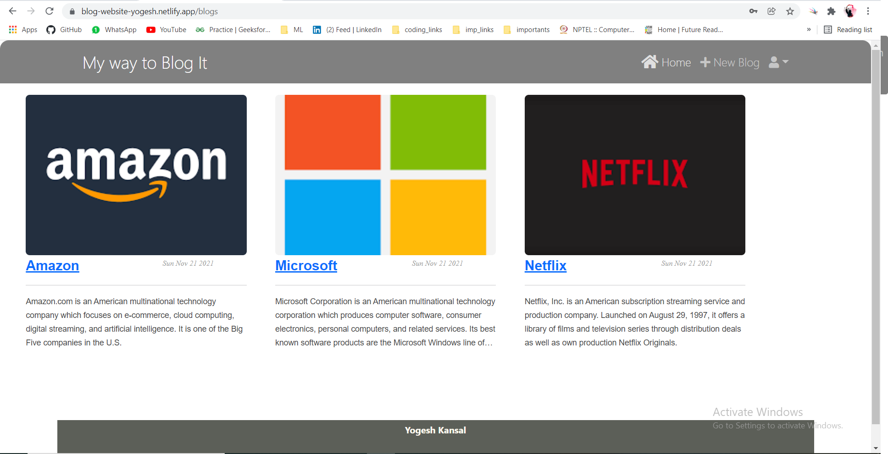

# blog-It.
`blog-it` is a MERN stack application for blogs.

## Tech Stack
`node.js`, `express.js`, `mongoose`, `jwt-auth`, `react.js`, `Bootstrap5`, `reactstrap`

## Features
- User signup
- User login/logout
- Standard form validation
- Protected Routes (jwt auth)
- Create, edit, delete a blog
- Blog List Page
- View a blog with comments
- comment on blog

## How to get started
- your machine must have latest versions of `node.js`, `mongodb` and `git`.
- do `git clone https://github.com/yogesh-kansal/blog-It..git`.
- go to `blog-it.` directory.
- go to `/blog-it./client` and do `npm install` in terminal.
- go to `/blog-it./backend` and do `npm install` in terminal.
- to start client/server do npm `start` in their respective termianls.

## Demo images
### Home page -

 
 

### List of created tests -

 
 

### blog with comments -

 
 

### New blog -

 
 

### User signup - 

 
 

### User loginp - 

 
 